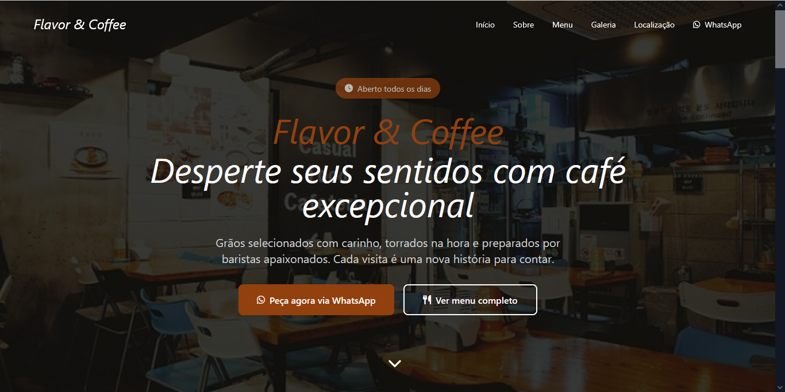

# One Page Cafeteria

Projeto de uma landing page (one page) para uma cafetaria.

O objetivo é apresentar informações essenciais como menu, localização, horários e contacto, com um layout moderno, escuro.

---

## Let's Access 🚀

🔗 **Acesse o projeto:** https://gracianoandreleite.github.io

---

## Preview

---

## Tecnologias

- HTML5 (semântica)
- Tailwind CSS
- JavaScript (interações e menu mobile)
- AOS (animações on scroll)
- Font Awesome (ícones)

---

## Funcionalidades

- Layout One Page
- Header fixo com efeito backdrop-filter
- Menu mobile responsivo
- Seções: Hero, Sobre, Menu, Galeria, Localização e Contacto
- Botão de contacto via WhatsApp
- Animações suaves e transições

---

## Contato
Se quiser entrar em contato:  

- **Email:** juniorpc255@gmail.com  
- **GitHub:** [github.com/gracianoandreleite](https://github.com/gracianoandreleite)  

---

## 📄 Licença

Este projeto é um template de website comercial. Todos os direitos reservados para Graciano André.